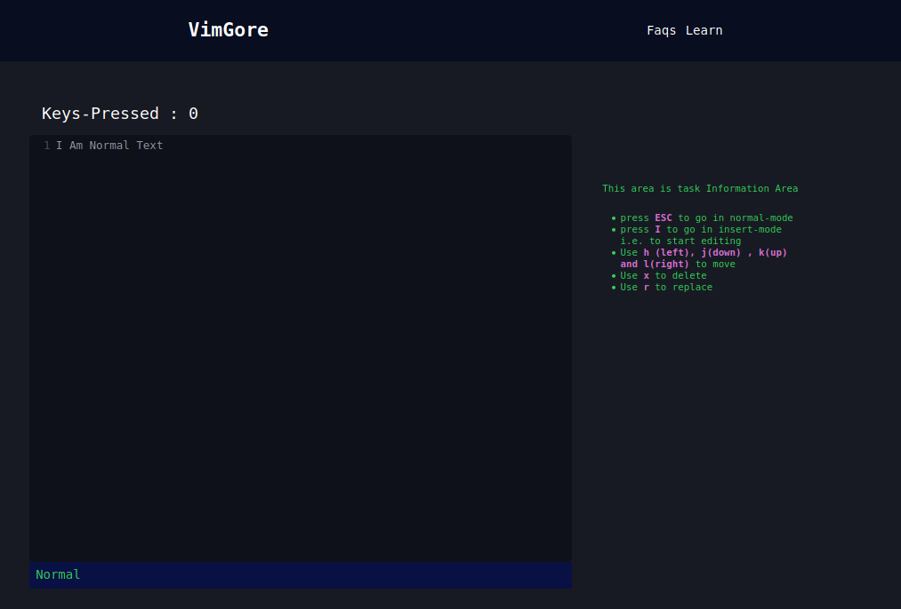

<h1 align="center">
   
  Vim Gore
   
</h1>

<h4 align="center">An Interactive Game to learn Vim</h4>

<h4 align="center"><a href="https://vimgore.netlify.app/">Play Here</a> </h4>

## How To Use

You will see an editor and a snippet in it. There will be a task menu also where you can see the code
to write and also the minimum keystrokes required. If number of keystrokes is less than minimum keystrokes
then you are awarded 5 point other wise you are awarded 1 point only

## You may also like...

- [Vim](https://github.com/vim/vim) - Vim : a text editor 
- [Vim Golf](http://www.vimgolf.com/) - A vim based game

## License

MIT

---

- [personal site](https://ps173.github.io/portfolio-site/)    
- GitHub [ps173](https://github.com/ps173)   
- Twitter [@mehmehsloth](https://twitter.com/mehmehsloth)   

#### Features To Achieve / Todos 
---- 

 - [x] UI and Functionality 
 - [x] Backend -> API
 - [x] Backend -> react api integration
 - [ ] Providing View of all question
 - [ ] Mobile View 
    - [ ] Mobile Friendly View
    - [ ] Some common keys as esc as button
 - [ ] Enabling User Authentiacation Via Github
 - [ ] Enabling Users to add Question
 - [x] Keybind Page
 - [x] Faq Page
